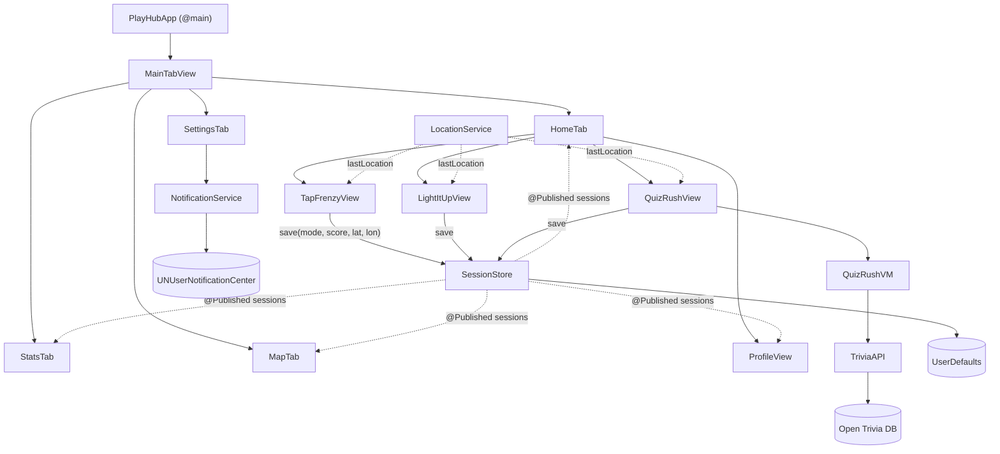

# PlayHubApp

A SwiftUI iOS app that bundles three quick games: **Tap Frenzy**, **Light It Up** and **Quiz Rush**. It adds a player profile, per-game leaderboards and charts, a map of where each game was played, and a daily reminder. It has no third-party dependencies.

---

## Features

### Games

**🔥 Tap Frenzy**: tap the button as many times as you can in 10 seconds.

| Mechanic | Rule |
|---|---|
| Combo | Taps less than 0.5 s apart raise the multiplier. Each tap scores the current combo value. |
| Trap colours | Every 2 s the button changes colour. Grey (a 1 in 3 chance) is a trap: tapping it *subtracts* the combo value. |
| Moving target | Every 2 s the button jumps to a random position. |
| Shrinking button | The button shrinks from 180 pt to 60 pt as time runs out. |
| Bonus burst | 4 s into the round, points are doubled for 2 s. |

**💡 Light It Up**: tap the glowing card before it goes dark. A round lasts 60 seconds and you have 4 lives. Each lit card you tap scores +10. Tapping a dark card, or letting a lit card go dark, costs a life. Difficulty increases automatically with your score:

| Level | Reached at | Cards | Lit at once | Time to tap |
|---|---|---|---|---|
| L1 | 0 | 3 | 1 | 2.0 s |
| L2 | 30 | 4 | 1 | 1.6 s |
| L3 | 70 | 6 | 1 | 1.2 s |
| L4 | 120 | 9 | 2 | 0.9 s |

**🧠 Quiz Rush**: 10 multiple-choice questions fetched live from the [Open Trivia DB](https://opentdb.com) API.
- Choose one of 10 categories (or *Any*) and a difficulty: Easy, Medium or Hard.
- A correct answer scores +10. From the 3rd correct answer in a row onward, each correct answer earns an extra +5 streak bonus. A wrong answer costs −3, and the score can't go below 0.
- Answers are colour-coded A–D and the question card shakes on a wrong answer. The game moves to the next question after 2.5 s.
- The game has loading and error screens with *Retry* and *Change Options* buttons.

Every game keeps its own high score, saves each finished round, and lets you share your score with `ShareLink`.

### App

- **Home**: game cards and a **daily challenge** banner. The challenge (a game and a target) is picked from the date, so it's the same all day. You can dismiss it for the day, and it hides once you've played that game today.
- **Profile**: set a player name (used on leaderboards) and a photo avatar using `PhotosPicker`, and see total games, best score, favourite game and a per-game breakdown.
- **Stats**: pick a game from a segmented control to see games played, best score, a top-10 leaderboard, and a Swift Charts bar chart of the last 15 scores with an average line. Each game's screens link straight to its own leaderboard.
- **Map**: each game played with a location becomes a pin, coloured by game and labelled with the score. The map opens on the most recent game, or on Colombo if there's nothing to show.
- **Settings**: turn on a daily reminder notification, pick its time and which game it promotes, or reset all stats (after a confirmation).

---

## Architecture overview

The app is a SwiftUI app organised by layer. Its core is `SessionStore`, one shared `ObservableObject`. Every finished game writes to it, and every screen that shows history reads from it. When a game ends, Home, Stats, Map and Profile all update without any code linking them together.



### Project structure

```
PlayHubApp/
├── App/          PlayHubApp.swift: entry point; asks for notification permission and starts location updates
├── Models/       GameMode, GameSession + SessionStore, DailyChallenge, TriviaQuestion
├── Services/     TriviaAPI, LocationService, NotificationService
├── ViewModels/   QuizRushVM  (TapFrenzyVM, LightItUpVM, StatsVM are empty placeholders)
├── Views/
│   ├── MainTabView.swift, ProfileView.swift
│   ├── Tabs/     HomeTab, StatsTab, MapTab, SettingsTab
│   └── Games/    TapFrenzyView, LightItUpView, QuizRushView
└── Shared/       AppBackground  (ResultView, ScoreBadge are placeholders)
```

### Layers

| Layer | Responsibility |
|---|---|
| **Models** | `GameMode` is a `Codable` enum that also gives each game its colour. `GameSession` is one finished game (mode, score, time, coordinates, player name). `SessionStore` is the singleton that holds, queries and saves sessions. `DailyChallenge` picks the day's challenge. `Question`/`TriviaResponse` match the API's JSON. |
| **Services** | `TriviaAPI` builds the request URL with `URLComponents`, fetches it with `async`/`await` `URLSession` (12 s timeout) and decodes the response. `LocationService` wraps `CLLocationManager` and publishes `lastLocation`. `NotificationService` schedules a repeating `UNCalendarNotificationTrigger`. |
| **ViewModels** | `QuizRushVM` is a `@MainActor` `ObservableObject` that moves through `setup → loading → loaded / failed`, and handles scoring, streaks and question order. |
| **Views** | `MainTabView` gives each of its four tabs its own `NavigationStack`. The Tap Frenzy and Light It Up views hold their own game state (`@State`) and run their timers with Combine's `Timer.publish`. |

### Data storage

Everything is stored locally in `UserDefaults`:

| Key | Written by | Contents |
|---|---|---|
| `saved_sessions` | `SessionStore` | Every finished game, stored as a JSON-encoded `[GameSession]` |
| `tapFrenzyHighScore`, `lightItUpHighScore`, `quizRushHighScore` | Game views (`@AppStorage`) | The "Best" score shown on each game's screens |
| `globalPlayerName`, `profileImageData` | `ProfileView` | Player name added to each new session, and the avatar image |
| `dismissedChallengeDate` | `HomeTab` | The date (`yyyy-MM-dd`) the challenge banner was last dismissed |
| `dailyNotificationsEnabled`, `notificationGameType` | `SettingsTab` | Whether the reminder is on, and which game it promotes |

### Design decisions

- **Stale timer protection (Light It Up).** Card lighting runs on chained `DispatchQueue.main.asyncAfter` closures, not a fixed polling timer. Each closure records a `generation` number when it's scheduled. Levelling up, ending the game or restarting increases the number, so closures from an earlier round do nothing when they fire.
- **Stable answer order (Quiz Rush).** `Question.shuffledAnswers` shuffles again every time it's read. The view model therefore shuffles each question's answers once when the questions load and caches them, so answers don't move when SwiftUI redraws the view after a tap.
- **Backward-compatible saves.** `GameSession` has a custom `init(from:)` that uses `decodeIfPresent` for `id` and `playerName`. Sessions saved before player names were added still load.
- **Daily challenge with no storage or network.** The day's number in the calendar picks the game (`day % 3`) and the target text (`(day / 3) % 4`). Everyone gets the same challenge on the same day.
- **Spread-out map pins.** Each saved coordinate is moved by a random amount of up to ±0.0005° (about 50 m), so games played in the same place show as separate pins instead of one stacked pin.

### Tech stack

SwiftUI · Combine · Swift Concurrency · URLSession · Codable · Swift Charts · MapKit · Core Location · UserNotifications · PhotosUI

---

## Getting started

**Requirements:** Xcode 26 or later, and an iOS 26 simulator or device (the deployment target is iOS 26.0).

1. Open `TapFrenzy.xcodeproj`. The Xcode project, target, scheme and bundle ID (`savishka.TapFrenzy`) still use the app's original name. The source folder and app struct were renamed to PlayHubApp.
2. Under *Signing & Capabilities*, choose your own development team.
3. Build and run the **TapFrenzy** scheme.
4. On the simulator, set a location (*Features ▸ Location*) so that games get map pins.
5. Quiz Rush needs an internet connection.

---

## Known limitations

### Known bugs

- **Light It Up never shows its game-over screen.** `endGame()` sets `gameStarted = false`, and the view checks `!gameStarted` before it checks `gameOver`, so the player goes back to the start screen instead. That game's *Share* button and "New high score" message never appear.
- **"Reset All Stats" doesn't reset the high scores.** It clears the session history but not the three `@AppStorage` high scores. Each game's start screen keeps showing the old "Best" while the Stats tab shows 0.
- **Games played without a location show up off the coast of Africa.** A game that ends with no location fix is saved at 0°, 0°. The ~50 m pin offset is added before saving, so the coordinates are no longer exactly zero and the Map tab's `latitude != 0` filter lets them through. The pins appear in the Gulf of Guinea, and the map opens there if that was the latest game.
- **"Member since" always shows today's date.** The `@AppStorage` default value is never saved.
- **The reminder time isn't saved.** Settings shows 10:00 every time the app launches, and changing the reminder type reschedules the reminder for whatever time is displayed.
- **Every Quiz Rush failure shows "API Rate Limit Hit".** Being offline, a timeout and "no questions for this category and difficulty" all show the same message, because `TriviaAPI` groups non-API errors together and the view shows one fixed message.
- **The Quiz Rush feedback banner always says "+10 pts"**, even when the streak bonus awards 15.

### Design and scope limitations

- **MVVM is only partly applied.** Only Quiz Rush has a real view model. Tap Frenzy and Light It Up keep their game logic in the views, so it can't be unit-tested on its own. `TapFrenzyVM`, `LightItUpVM`, `StatsVM`, `ResultView` and `ScoreBadge` are empty placeholders.
- **High scores are stored in two places:** `@AppStorage` per game, and `SessionStore.bestScore(for:)`. This is why the reset bug above happens.
- **Everything is local to the device.** There are no accounts and no backend. The leaderboard ranks sessions played on this device, and each session keeps the player name that was set when it was saved, so renaming doesn't change past entries.
- **`UserDefaults` is used for all storage.** The session history grows without limit and is re-encoded in full on every save. The profile photo is stored at full size. SwiftData or file storage would suit this data better.
- **Daily challenges aren't checked.** The banner disappears once you play that day's game, whether or not you reach the target. Some targets (for example "Survive 10 rounds") aren't tracked at all.
- **Location and permissions.** Location updates run at best accuracy from launch until the app closes, even though a location is only needed when a game ends. The notification and location permission prompts both appear on first launch, before the user knows what they're for.
- **Quiz Rush depends on Open Trivia DB.** It needs a connection and is subject to the API's rate limit. The app decodes only 13 HTML entities (such as `&quot;`); any others appear as raw text.
- **Layouts are built for a portrait iPhone.** They use fixed sizes and padding, although the build settings also allow landscape and iPad.
- **There are no automated tests.** The project has no test target.

---

## Reflection

PlayHubApp began as a single tap game and grew one feature at a time over about seven weeks. Tap Frenzy came first, then Light It Up, then Quiz Rush with a live API, and finally the tab bar with stats, a map, notifications and a profile. Building it step by step kept each change small, and you can see that in the structure. I only split the code into Models / Services / ViewModels / Views once most features already existed, and only Quiz Rush was fully moved to a view model.

The hardest problems were about timing and state, not layout. Light It Up first used a polling timer. Moving to scheduled closures meant that timers from an earlier level or round could still fire, and the `generation` counter fixed that. In Quiz Rush, answers moved to new positions whenever SwiftUI redrew the view until I cached the shuffle. Adding player names to saved sessions taught me to write a custom `Decodable` initialiser so that older saved data still loads. The live API showed that a real service fails in ways a mock doesn't, with rate limiting the main one.

If I continued the project, I would move the Tap Frenzy and Light It Up logic into their view models so it can be unit-tested, keep high scores in `SessionStore` only, and replace `UserDefaults` with SwiftData. Reviewing the code for this README also turned up the bugs listed above. Most of them are small, and tests written alongside the features would probably have caught them earlier.
